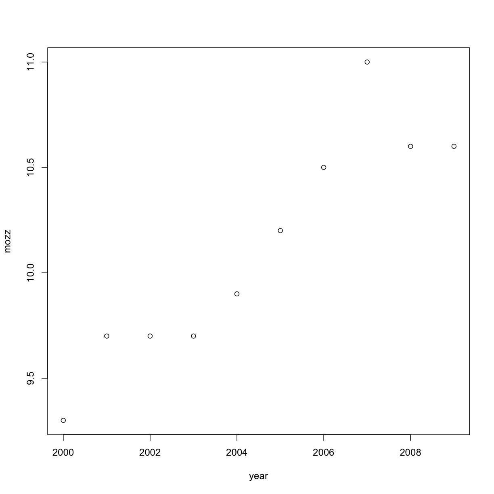
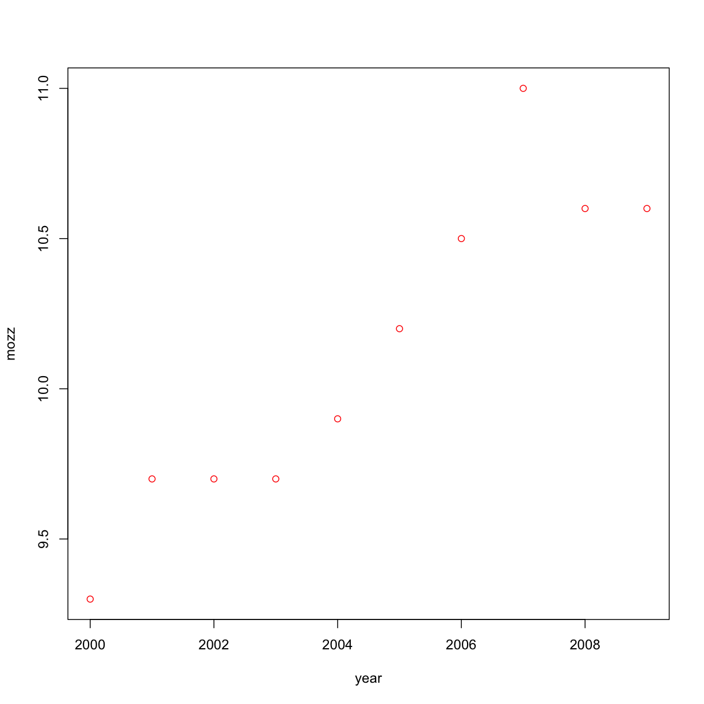
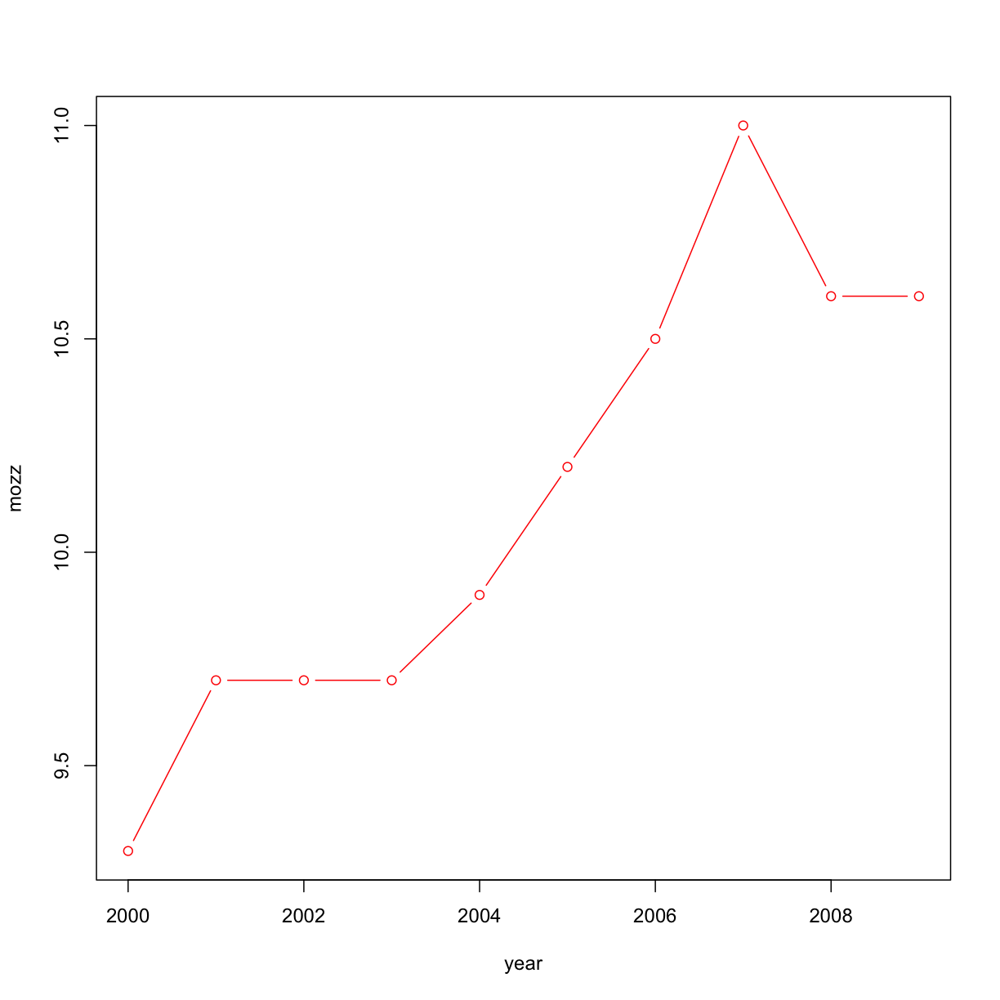
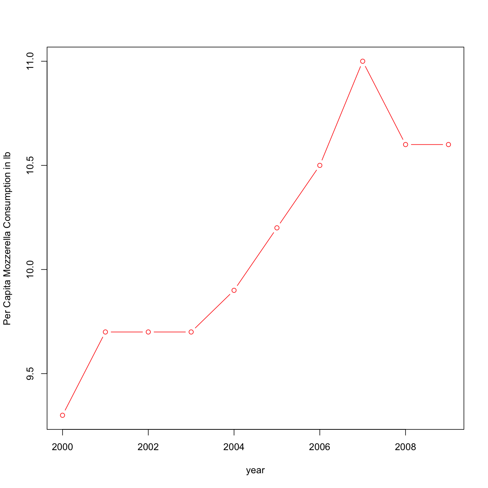
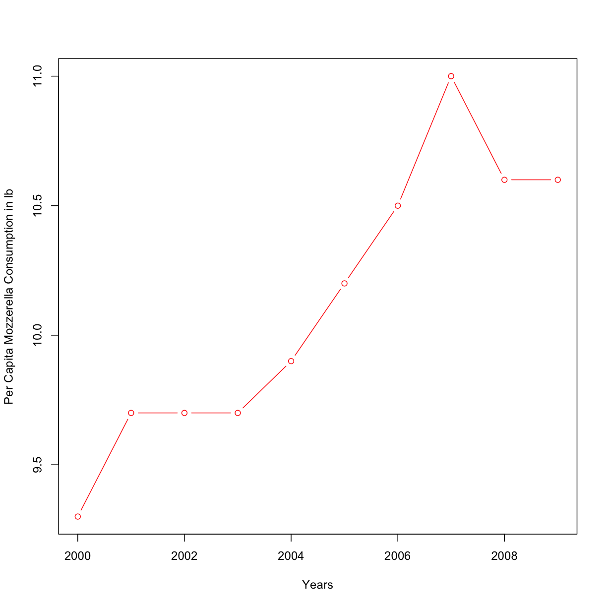
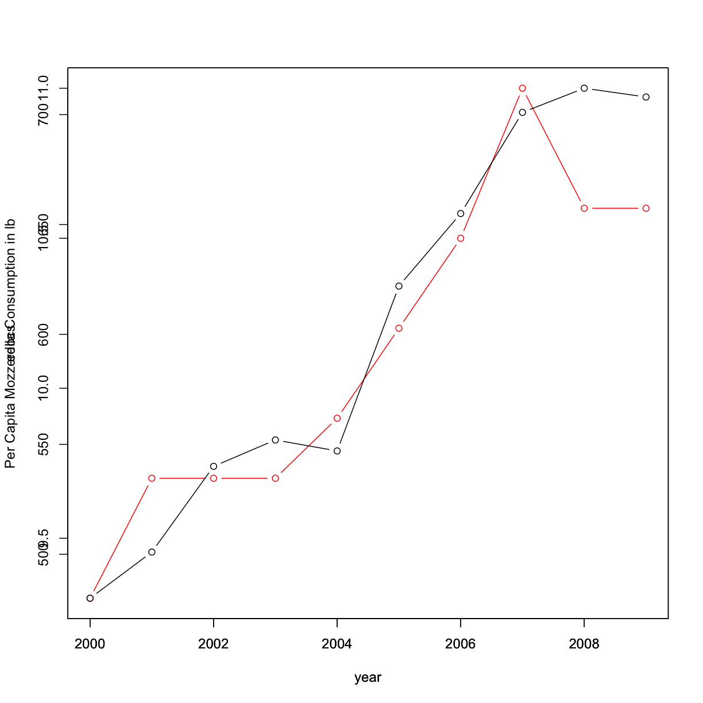
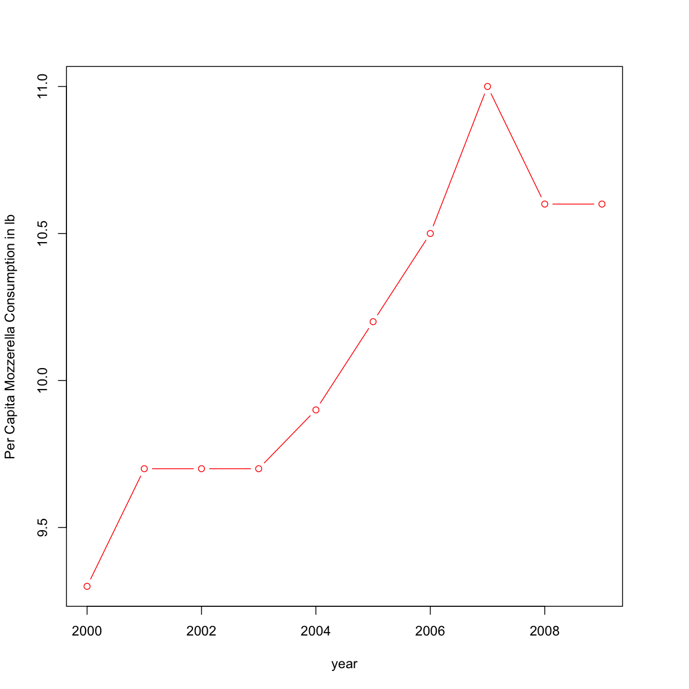
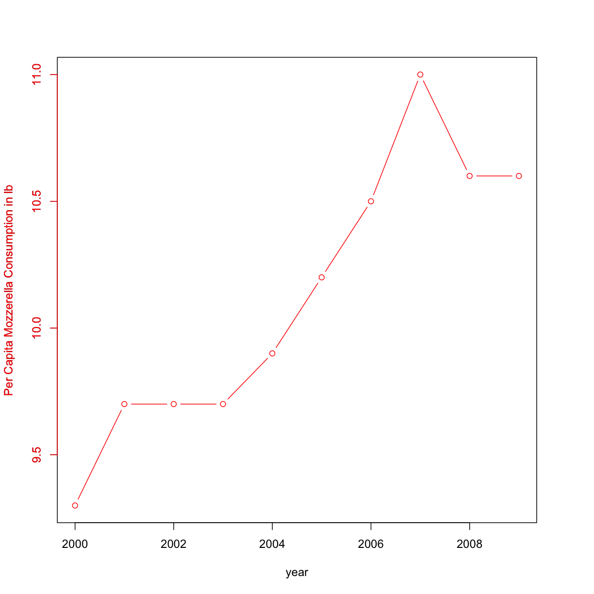
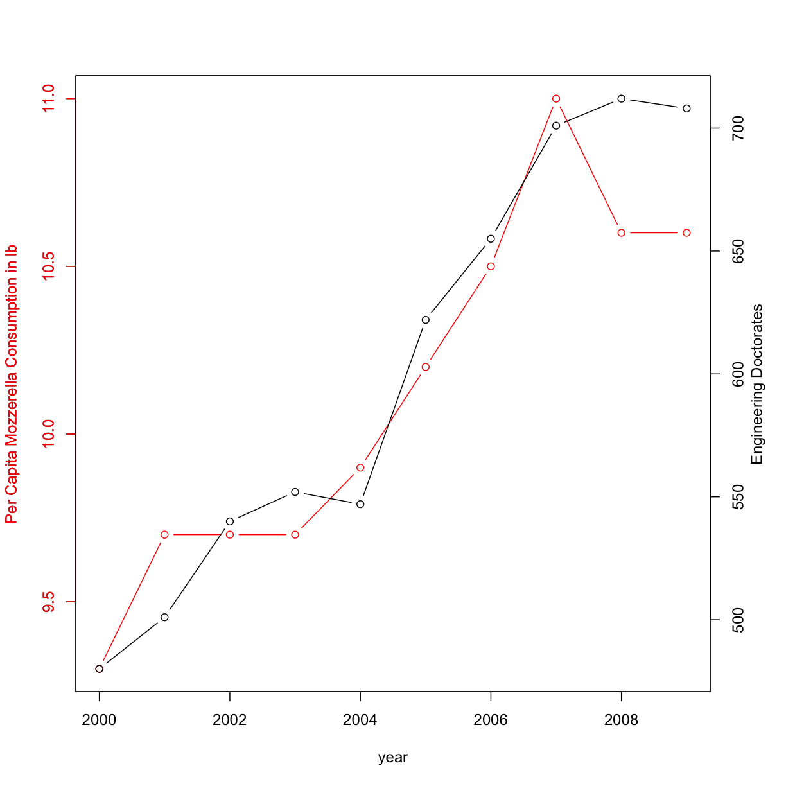
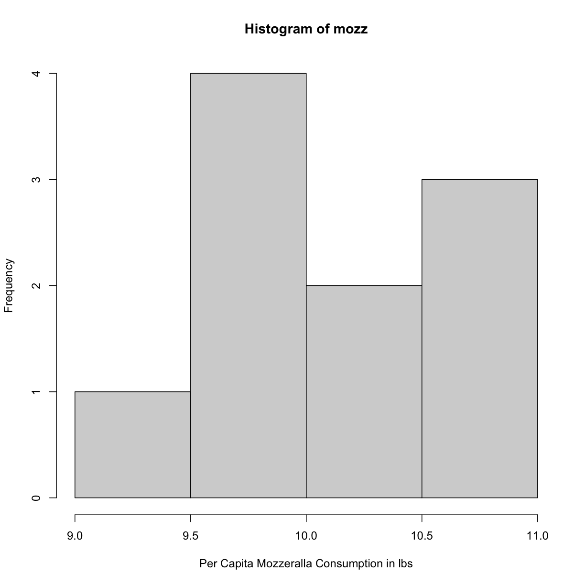

---
# Please do not edit this file directly; it is auto generated.
# Instead, please edit 01-Course_Introduction.md in _episodes_rmd/
title: "Course Intro & Motivation, Intro to R"
include_overview: true
week: 1
readings:
 - This week will be an introduction to the course topics & the R programming language.
 - If we have time we'll start discussing topics from OIS 1.1, 1.2, 1.3 & 2.1.
questions:
 - What is R and RStudio and how can we use them to read in data and make plots?
 - What are some ways we can summarize a dataset?
objectives:
 - Learn programming concepts and terms
 - Learn how to open up RStudio and use it to plot data
 - Learn definitions and ways to calculate various summary statistics
keypoints:
 - "In programming there is certain terminology we need to learn: variables, variable types, functions"
 - "Use `read.csv` to read data in to R"
 - "Use R functions to calculate summary statistics"
source: Rmd
---

<!-- JPN: attribution formatting -->

# Why take Statistics as an Information Scientist?

Our main motivation for this course is to try to answer the question:  "How well can we know anything, really?"

In particular, some of the things we want to know are:
 * What kinds of questions can we ask with data?
 * How accurately can we answer those questions from a particular
dataset? How does this depend on features of this dataset (e.g.
how data was procured)?
 * How can we make predictions from collected data? What is the "accuracy" of those predictions?
 * How can we use computational tools to answer statistical questions?

# Reading and Plotting Data with R

We'll be grabbing some data from [Spurious Correlations](http://www.tylervigen.com/spurious-correlations) which has a lot of great examples of ways to "lie" with data by showing correlations and implying causation.  In particular we'll be looking at the relationship between cheese consumption and engineering Ph.D.'s awarded per year:

To remake this plot, we need to first have the data to do so!  We'll enter this "by hand" by putting the data in with vectors, which in R are denoted by a `c()`:

~~~
year <- c(2000, 2001, 2002, 2003, 2004, 2005, 2006, 2007, 2008, 2009)
mozz <- c(9.3, 9.7, 9.7, 9.7, 9.9, 10.2, 10.5, 11, 10.6, 10.6)
edocs <- c(480, 501, 540, 552, 547, 622, 655, 701, 712, 708)
~~~
{: .language-r}

## Basic plotting using R

Let's make a quick plot of some of this data:

~~~
plot(year,mozz)
~~~
{: .language-r}

What if we want nice red dots like on the website?

~~~
plot(year,mozz,col="red")
~~~
{: .language-r}

But hey, what about connecting them with lines?

~~~
plot(year,mozz,col="red",type='b')
~~~
{: .language-r}

What if we want more detail than the confusing "mozz" on the y axis?

~~~
plot(year,mozz,col="red",type="b", ylab="Per Capita Mozzerella Consumption in lb")
~~~
{: .language-r}

> ## Changing the x-axis label
>
> How do you think you'd change call of the plotting function to change the x-axis label from "year" to "Years"?
>
> > ## Solution
> >
> > 
> > ~~~
> > plot(year,mozz,col="red",type="b", ylab="Per Capita Mozzerella Consumption in lb", xlab="Years")
> > ~~~
> > {: .language-r}
> > 
> > 
> {: .solution}
{: .challenge}

Now let's plot the # of engineering docs as a function of time as well:

~~~
plot(year,mozz,col="red",type="b", ylab="Per Capita Mozzerella Consumption in lb")
par(new=TRUE) # we use this to overplot
plot(year,edocs,col="black",type="b")
~~~
{: .language-r}

<!-- JPN: TBD will be to update this -- I feel like we could do more useful things here -->

But wait! the axis look horrible!  Let's try this again:

~~~
par(mar = c(5,4,4,4) + 0.1) # this just adds a buffer onto the right axis
plot(year,mozz,col="red",type="b", ylab="Per Capita Mozzerella Consumption in lb")
~~~
{: .language-r}

Let's change the color of the axis for Per Mozz consumption:

~~~
par(mar = c(5,4,4,4) + 0.1) # this just adds a buffer onto the right axis
plot(year,mozz,col="red",type="b", ylab="Per Capita Mozzerella Consumption in lb")

axis(2,col="red",col.ticks="red",col.axis="red",col.lab="red")
mtext("Per Capita Mozzerella Consumption in lb", side=2, line=3, col="red")
~~~
{: .language-r}

Now, let's add back in the engineering PhD data:

~~~
par(mar = c(5,4,4,4) + 0.1) # this just adds a buffer onto the right axis
plot(year,mozz,col="red",type="b", ylab="Per Capita Mozzerella Consumption in lb")

axis(2,col="red",col.ticks="red",col.axis="red",col.lab="red")
mtext("Per Capita Mozzerella Consumption in lb", side=2, line=3, col="red")

par(new=TRUE) # we use this to over plot
plot(year,edocs, type = "b", xaxt = "n", yaxt = "n", ylab = "", xlab = "")
axis(side = 4)
mtext("Engineering Doctorates", side = 4, line = 2)
~~~
{: .language-r}

Hurray!  We have a cool looking plot!

## Plotting Histograms in R

Maybe instead of a trend over time we want to know what is the distribution of the per capita cheese consumption. We can do this with the histogram:

~~~
hist(mozz,xlab="Per Capita Mozzeralla Consumption in lbs")
~~~
{: .language-r}

Here the y-axis is showing the frequency of a certain value - how often a value shows up in our data. It looks like ~9.75 and 10.75 pounds are the most frequent values.  

Its worth noting this distribution is somewhat "bimodal" in that there are sort of 2 distinct peaks.  However, the number of measurements is very small here, so its hard to tell for sure.  This could be a "unimodal" distribution peaked around 9.75 lbs.

## Summary statistics in R

We can also print out some summary statistics of our per capita cheese consumption vector:

~~~
summary(mozz)
~~~
{: .language-r}

~~~
   Min. 1st Qu.  Median    Mean 3rd Qu.    Max. 
   9.30    9.70   10.05   10.12   10.57   11.00 
~~~
{: .output}

We can also calculate these statistics seperately:

~~~
mean(mozz)
~~~
{: .language-r}

~~~
[1] 10.12
~~~
{: .output}

~~~
median(mozz)
~~~
{: .language-r}

~~~
[1] 10.05
~~~
{: .output}

~~~
var(mozz) # this is the "varience" which we'll discuss in a minute
~~~
{: .language-r}

~~~
[1] 0.2928889
~~~
{: .output}

~~~
sd(mozz) # this is the standard deviation
~~~
{: .language-r}

~~~
[1] 0.5411921
~~~
{: .output}

## Reading in and analyzing data with R

Let's try a larger dataset. In general to find data, check out data.gov or just google "statistical datasets" or there are some embedded in "R" as well, but let's try reading from a file first.

This is a file of random "tests" of before and after.  This is just a toy dataset but lets just say its a measure of resting heart rate before & after a drug trial.

~~~
mydata = read.csv("data/hr_trialData.csv",header=TRUE,stringsAsFactors=FALSE)
~~~
{: .language-r}

> ## Other file locations
> Make sure this file is stored somewhere you can remember!  You can put it in the same directory as this file (or whatever R-script you are working from) or you can specify a location.  For example, on my Mac I can specify the default `Downloads` folder as the location with:
> 
> ~~~
> mydata = read.csv("~/Downloads/hr_trialData.csv",header=TRUE,stringsAsFactors=FALSE)
> ~~~
> {: .language-r}
> 
> Note: often times you'll see assignment happening in R with the `<-` symbols:
> ~~~
> mydata <- read.csv("~/Downloads/hr_trialData.csv",header=TRUE,stringsAsFactors=FALSE)
> ~~~
> {: .language-r}
> This is just another way to denote assignment, and works the same as an `=` sign.
{: .callout}

Let's take a look at our data:

~~~
print(mydata)
~~~
{: .language-r}

~~~
   Before After
1      52    40
2      44    49
3      45    41
4      47    50
5      45    45
6      40    46
7      45    47
8      47    44
9      49    45
10     42    43
11     43    47
12     43    41
13     43    39
14     NA    42
~~~
{: .output}

Note, we can also just print out the first few rows of our dataset using `head`:

~~~
head(mydata, n=4)
~~~
{: .language-r}

~~~
  Before After
1     52    40
2     44    49
3     45    41
4     47    50
~~~
{: .output}

e can compare the print statement to [what is in the file](data/hr_trialData.csv) as well.   Notice there is an NA - this just means there is no data there.

Since its assumed folks are generally coming from an intro programming background using Python, we can first start by using R "Pythonically" and grabbing data into vectors of columns:

~~~
before = mydata[,1]
after = mydata[,2]
~~~
{: .language-r}

Check out the summary stats for both:

~~~
summary(before)
~~~
{: .language-r}

~~~
   Min. 1st Qu.  Median    Mean 3rd Qu.    Max.    NA's 
     40      43      45      45      47      52       1 
~~~
{: .output}

~~~
summary(after)
~~~
{: .language-r}

~~~
   Min. 1st Qu.  Median    Mean 3rd Qu.    Max. 
  39.00   41.25   44.50   44.21   46.75   50.00 
~~~
{: .output}

<!-- Slideshow container -->
<!-- this one: https://www.w3schools.com/howto/howto_js_slideshow.asp -->

  <!-- Full-width images with number and caption text -->
  

    
1 / 3

    <!---->
    <embed src="../lectureSlides/week01/slide1.pdf#toolbar=0&navpanes=0&scrollbar=0"/>
    
Some of these may look familar but some might be new -- the mean, median and quartiles might be new.

  

  

    
2 / 3

    <embed src="../lectureSlides/week01/slide2.pdf#toolbar=0&navpanes=0&scrollbar=0" />
    
Mean and Median represent the typical value of your numerical dataset.

  

  
  

    
3 / 3

    <embed src="../lectureSlides/week01/slide3.pdf#toolbar=0&navpanes=0&scrollbar=0" />
    
Standard deviation and quartiles give measures of the variability in the data.

  

<!--  

    
2 / 3

    
    
Mean and Median represent the typical value of your numerical dataset.

  

  

    
3 / 3

    
    
Standard deviation and quartiles give measures of the variability in the data.

  
 -->

  <!-- Next and previous buttons -->
  <a class="prev" onclick="plusSlides(-1)">&#10094;</a>
  <a class="next" onclick="plusSlides(1)">&#10095;</a>

 

<!-- The dots/circles -->

  
  
  

<!-- Actually run the script -->

