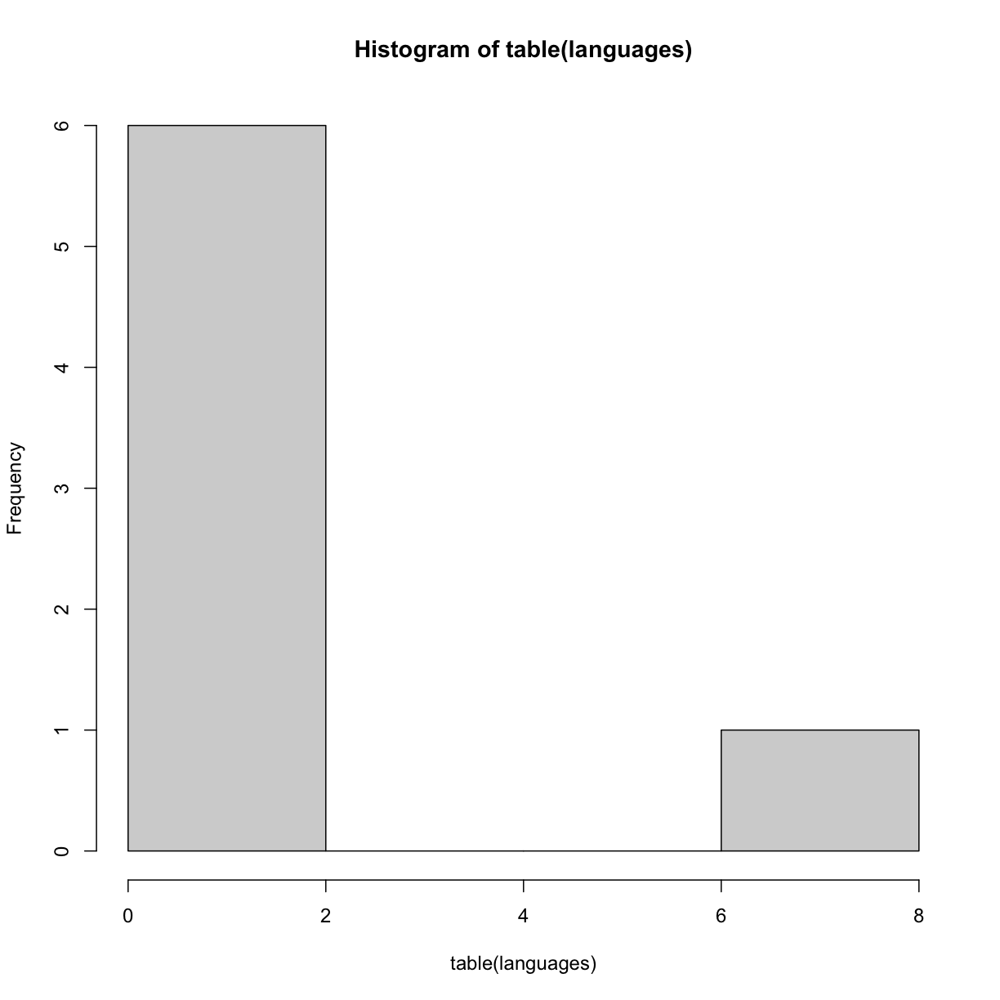
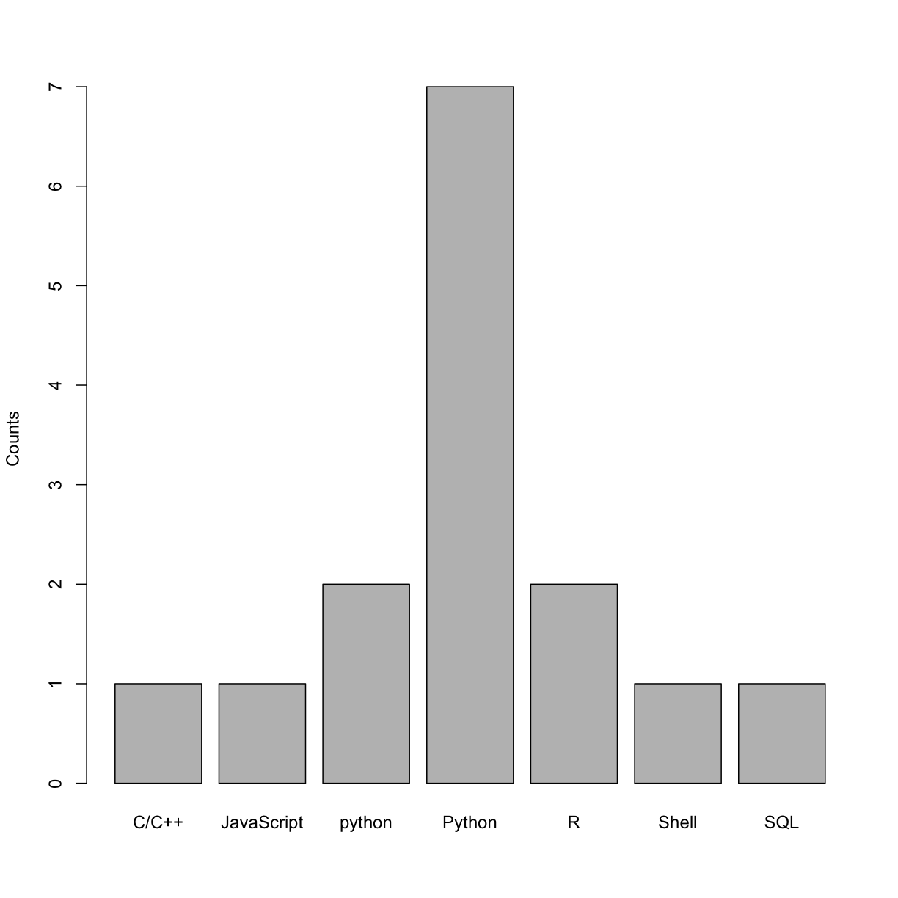

---
# Please do not edit this file directly; it is auto generated.
# Instead, please edit 02-Numerical_Data.md in _episodes_rmd/
title: "Intro to Numerical Data, Continuing Intro to R"
include_overview: true
week: 2
readings:
 - This weeks topics cover remaining parts of OIS 1.1, 1.2, 1.3, 2.1; OIS 1.4 & 2.3 (we won't cover 2.3 yet, but will cover the concepts presented here later in the class so feel free to read it over now).
 - We will also cover ITR 1, 2, 5, 6, 7, 12 (ITR can be skimmed or read in depth depending on comfort level with coding)
questions:
 - How can we analyze numerical data?
 - TBD
objectives:
 - TBD
keypoints:
 - "TBD"
source: Rmd
<!--latex_engine: xelatex-->
---

<!-- JPN: attribution formatting -->

## Summary statistics and histograms with data in R

### Review

Last time we talked about some *summary statistics* and how to calculate them for data that is made up of numbers:
  * the *mean* is the sum of all data values divided by the number of data points
  * the *median* can be thought of as the "middle" number that splits the data into two halves if we order numerical data from smallest to largest
  * the *standard* deviaion is the square root of something called the *varience* which is roughly the average distnace of data values from the mean
  * the *first/third quartiles* delinate where 25% of the data falls below (first) and above (third) if we ordered the data from smallest to largest (the *median* is like the 50% or second quartile)

Let's do some analysis with "fake" class data showing programming histories of students in the class.

~~~
classData = read.csv("data/formatted_class_answers.csv", stringsAsFactors=T)
# note: this is a placeholder for real data
~~~
{: .language-r}

Make sure this file is stored somewhere you can remember!  You can put it in the same directory as this file (or whatever R-script you are working from) or you can specify a location.  For example, on my Mac I can specify the default `Downloads` folder as the location with:

~~~
classData = read.csv("~/Downloads/formatted_class_answers.csv", stringsAsFactors=T)
~~~
{: .language-r}

What is in this dataset?

~~~
classData
~~~
{: .language-r}

~~~
    X familiarity.with.stats programming.language           time.programming
1   1                      3                    R                 < 6 months
2   2                      3                    R Between 6 months to 1 year
3   3                      2               Python                 < 6 months
4   4                      3               Python Between 6 months to 1 year
5   5                      3               Python                 < 6 months
6   6                      2               Python                 < 6 months
7   8                      2                C/C++                  2-4 years
8   7                      2                Shell                  1-2 years
9   9                      3               python Between 6 months to 1 year
10 10                      3               python                  1-2 years
11 11                      3               Python                  2-4 years
12 12                      3               Python                 < 6 months
13 13                      2           JavaScript                  > 4 years
14 14                      2               Python Between 6 months to 1 year
15 15                      2                  SQL Between 6 months to 1 year
~~~
{: .output}

What are the names of the columns?

~~~
colnames(classData)
~~~
{: .language-r}

~~~
[1] "X"                      "familiarity.with.stats" "programming.language"  
[4] "time.programming"      
~~~
{: .output}

Let's make a vector of the different languages folks use:

~~~
languages = classData[,3]
languages
~~~
{: .language-r}

~~~
 [1] R          R          Python     Python     Python     Python    
 [7] C/C++      Shell      python     python     Python     Python    
[13] JavaScript Python     SQL       
Levels: C/C++ JavaScript python Python R Shell SQL
~~~
{: .output}

We can also ask for the "levels" of these catagories:

~~~
print(levels(languages))
~~~
{: .language-r}

~~~
[1] "C/C++"      "JavaScript" "python"     "Python"     "R"         
[6] "Shell"      "SQL"       
~~~
{: .output}

Let's try making some plots of the language data.

~~~
hist(languages) # should produce an error since "languages" is NOT a count - its a bunch of strings
~~~
{: .language-r}

~~~
Error in hist.default(languages): 'x' must be numeric
~~~
{: .error}

Since `languages` is not numerical data, to make a histogram we have to play some tricks.  First, let's start by checking out the output of the `table` function:

~~~
table(languages) # shows how many "hits" for a specific language
~~~
{: .language-r}

~~~
languages
     C/C++ JavaScript     python     Python          R      Shell        SQL 
         1          1          2          7          2          1          1 
~~~
{: .output}

We can try using the `hist` function again:

~~~
hist(table(languages)) # plots something now, but is actually counting # of bottom level, not counts
~~~
{: .language-r}

Not quite what we want, so let's try another plotting function called `barplot`:

~~~
barplot(table(languages)) # which sort of does what we want
~~~
{: .language-r}

Note: there are some long strings that aren't showing we can try changing one - for example, "python" should be "Python":

~~~
print(levels(languages))
~~~
{: .language-r}

~~~
[1] "C/C++"      "JavaScript" "python"     "Python"     "R"         
[6] "Shell"      "SQL"       
~~~
{: .output}

We can fix this issue with some clever renaming of our levels:

~~~
print(levels(languages)[4]) # let's replace this
~~~
{: .language-r}

~~~
[1] "Python"
~~~
{: .output}

~~~
levels(languages)[4] = "Python" # with this
~~~
{: .language-r}

Take a look:

~~~
levels(languages)
~~~
{: .language-r}

~~~
[1] "C/C++"      "JavaScript" "python"     "Python"     "R"         
[6] "Shell"      "SQL"       
~~~
{: .output}

Let's try replotting:

~~~
barplot(table(languages))
~~~
{: .language-r}

But what is the y axis?

~~~
barplot(table(languages),ylab='Counts')
~~~
{: .language-r}

<!-- JPN: note you need double dollar signs for latex here -->
Ok, but for many languages this can be hard to see $$\rightarrow$$ maybe different colors for each? 

