---
# Please do not edit this file directly; it is auto generated.
# Instead, please edit 02-Numerical_Data.md in _episodes_rmd/
title: "Intro to Numerical Data, Continuing Intro to R"
include_overview: true
week: 2
readings:
 - This weeks topics cover remaining parts of OIS 1.1, 1.2, 1.3, 2.1; OIS 1.4 & 2.3 (we won't cover 2.3 yet, but will cover the concepts presented here later in the class so feel free to read it over now).
 - We will also cover ITR 1, 2, 5, 6, 7, 12 (ITR can be skimmed or read in depth depending on comfort level with coding)
questions:
 - How can we analyze numerical data?
 - TBD
objectives:
 - TBD
keypoints:
 - "TBD"
source: Rmd
<!--latex_engine: xelatex-->
---

<!-- JPN: attribution formatting -->

## Summary statistics and histograms with data in R

### Review

Last time we talked about some *summary statistics* and how to calculate them for data that is made up of numbers:
  * the *mean* is the sum of all data values divided by the number of data points
  * the *median* can be thought of as the "middle" number that splits the data into two halves if we order numerical data from smallest to largest
  * the *standard* deviaion is the square root of something called the *varience* which is roughly the average distnace of data values from the mean
  * the *first/third quartiles* delinate where 25% of the data falls below (first) and above (third) if we ordered the data from smallest to largest (the *median* is like the 50% or second quartile)

Let's do some analysis with "fake" class data showing programming histories of students in the class.

~~~
classData = read.csv("data/formatted_class_answers.csv", stringsAsFactors=T)
# note: this is a placeholder for real data
~~~
{: .language-r}

Make sure this file is stored somewhere you can remember!  You can put it in the same directory as this file (or whatever R-script you are working from) or you can specify a location.  For example, on my Mac I can specify the default `Downloads` folder as the location with:

~~~
classData = read.csv("~/Downloads/formatted_class_answers.csv", stringsAsFactors=T)
~~~
{: .language-r}

What is in this dataset?

~~~
classData
~~~
{: .language-r}

~~~
    X familiarity.with.stats programming.language           time.programming
1   1                      3                    R                 < 6 months
2   2                      3                    R Between 6 months to 1 year
3   3                      2               Python                 < 6 months
4   4                      3               Python Between 6 months to 1 year
5   5                      3               Python                 < 6 months
6   6                      2               Python                 < 6 months
7   8                      2                C/C++                  2-4 years
8   7                      2                Shell                  1-2 years
9   9                      3               python Between 6 months to 1 year
10 10                      3               python                  1-2 years
11 11                      3               Python                  2-4 years
12 12                      3               Python                 < 6 months
13 13                      2           JavaScript                  > 4 years
14 14                      2               Python Between 6 months to 1 year
15 15                      2                  SQL Between 6 months to 1 year
~~~
{: .output}

What are the names of the columns?

~~~
colnames(classData)
~~~
{: .language-r}

~~~
[1] "X"                      "familiarity.with.stats" "programming.language"  
[4] "time.programming"      
~~~
{: .output}

Let's make a vector of the different languages folks use:

~~~
languages = classData[,3]
languages
~~~
{: .language-r}

~~~
 [1] R          R          Python     Python     Python     Python    
 [7] C/C++      Shell      python     python     Python     Python    
[13] JavaScript Python     SQL       
Levels: C/C++ JavaScript python Python R Shell SQL
~~~
{: .output}

We can also ask for the "levels" of these catagories:

~~~
print(levels(languages))
~~~
{: .language-r}

~~~
[1] "C/C++"      "JavaScript" "python"     "Python"     "R"         
[6] "Shell"      "SQL"       
~~~
{: .output}

Let's try making some plots of the language data.

~~~
hist(languages) # should produce an error since "languages" is NOT a count - its a bunch of strings
~~~
{: .language-r}

~~~
Error in hist.default(languages): 'x' must be numeric
~~~
{: .error}

Since `languages` is not numerical data, to make a histogram we have to play some tricks.  First, let's start by checking out the output of the `table` function:

~~~
table(languages) # shows how many "hits" for a specific language
~~~
{: .language-r}

~~~
languages
     C/C++ JavaScript     python     Python          R      Shell        SQL 
         1          1          2          7          2          1          1 
~~~
{: .output}

We can try using the `hist` function again:

~~~
hist(table(languages)) # plots something now, but is actually counting # of bottom level, not counts
~~~
{: .language-r}

Not quite what we want, so let's try another plotting function called `barplot`:

~~~
barplot(table(languages)) # which sort of does what we want
~~~
{: .language-r}

Note: there are some long strings that aren't showing we can try changing one - for example, "python" should be "Python":

~~~
print(levels(languages))
~~~
{: .language-r}

~~~
[1] "C/C++"      "JavaScript" "python"     "Python"     "R"         
[6] "Shell"      "SQL"       
~~~
{: .output}

We can fix this issue with some clever renaming of our levels:

~~~
print(levels(languages)[4]) # let's replace this
~~~
{: .language-r}

~~~
[1] "Python"
~~~
{: .output}

~~~
levels(languages)[4] = "Python" # with this
~~~
{: .language-r}

Take a look:

~~~
levels(languages)
~~~
{: .language-r}

~~~
[1] "C/C++"      "JavaScript" "python"     "Python"     "R"         
[6] "Shell"      "SQL"       
~~~
{: .output}

Let's try replotting:

~~~
barplot(table(languages))
~~~
{: .language-r}

But what is the y axis?

~~~
barplot(table(languages),ylab='Counts')
~~~
{: .language-r}

<!-- JPN: note you need double dollar signs for latex here -->
Ok, but for many languages this can be hard to see $$\rightarrow$$ maybe different colors for each?

~~~
barplot(table(languages),ylab='Counts',col=c("red","blue","green","yellow","magenta"))
~~~
{: .language-r}

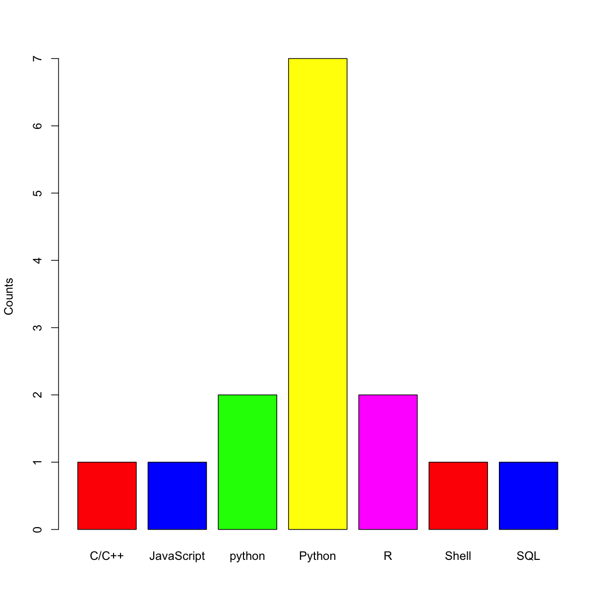

Ok cool, we see that a lot of folks use Python.

We can do the same sort of thing for the length of time folks have been coding:

~~~
time_in = classData[,4]
barplot(table(time_in)) 
~~~
{: .language-r}

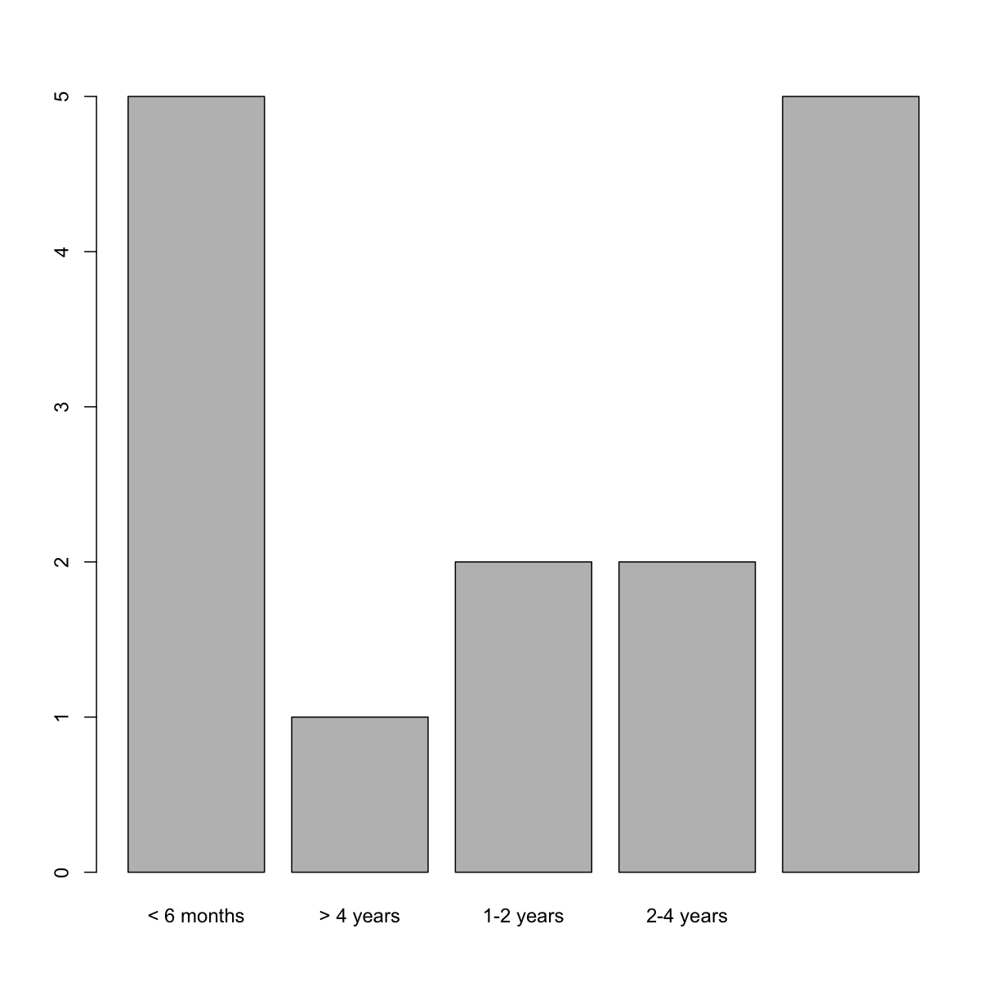
Note: In RStudio, you'll have to expand the window to see all the labels.

Ok, so this tells us *something* but its hard to get a sense of the actual timescales since they are not ordered & are non-uniform increments of time.

Additionally, things are "out of order" because they don't fall in nice ordered time bins.  This is because this data is stored as "categorical" data, i.e. in this case as strings:

~~~
levels(time_in)
~~~
{: .language-r}

~~~
[1] "< 6 months"                 "> 4 years"                 
[3] "1-2 years"                  "2-4 years"                 
[5] "Between 6 months to 1 year"
~~~
{: .output}

## Practicing for-loops and if-else statements

Let's reformat this data a bit and get some practice with for-loops in R in the process!

~~~
time_min = c() # storage, save the min edge of our bins in years
time_max = c() # storage, save the max edge of our bins in years
~~~
{: .language-r}

Let's look at the options again:

~~~
myLevels = levels(time_in)
print(myLevels)
~~~
{: .language-r}

~~~
[1] "< 6 months"                 "> 4 years"                 
[3] "1-2 years"                  "2-4 years"                 
[5] "Between 6 months to 1 year"
~~~
{: .output}

Now we get to practice doing a for-loop in R.  Note, it is similar to how it's done in Python, but there are a few differences!  The syntax is generally:

~~~
for (loop_index in 1:Number_of_loops){
   # DO STUFF
}
~~~
{: .language-r}

Note that this definition includes `{}` instead of indentations to denote what is contained in the for-loop.  (if-statements are denoted similary as we'll see below.)

Let's do a for loop and determine bins by hand:

~~~
for (i in 1:length(time_in)){
  if (time_in[i] == "< 6 months"){ # < 6 months
    time_min = c(time_min,0)
    time_max = c(time_max, 0.5) # in years => 0.5 years = 6 months
  } else if (time_in[i] == "Between 6 months to 1 year") { # 0.5-1 years
    time_min = c(time_min, 0.5)
    time_max = c(time_max, 1.0)
  } else if (time_in[i] == "1-2 years") { # 1-2 years
    time_min = c(time_min, 1.0)
    time_max = c(time_max, 2.0)
  } else if (time_in[i] == "2-4 years") { # 2-4 years
    time_min = c(time_min, 2.0)
    time_max = c(time_max, 4.0)
  } else { # otherwise, >4 years
    time_min = c(time_min,4.0) 
    time_max = c(time_max,5.0) # just giving an arbitrary upper bound of 5 years
  }
}
~~~
{: .language-r}

~~~
print(time_min)
~~~
{: .language-r}

~~~
 [1] 0.0 0.5 0.0 0.5 0.0 0.0 2.0 1.0 0.5 1.0 2.0 0.0 4.0 0.5 0.5
~~~
{: .output}

~~~
print(time_max)
~~~
{: .language-r}

~~~
 [1] 0.5 1.0 0.5 1.0 0.5 0.5 4.0 2.0 1.0 2.0 4.0 0.5 5.0 1.0 1.0
~~~
{: .output}

Let's say the mid-point of this data is the `time`:

~~~
time = 0.5*(time_min+time_max)
hist(time)
~~~
{: .language-r}

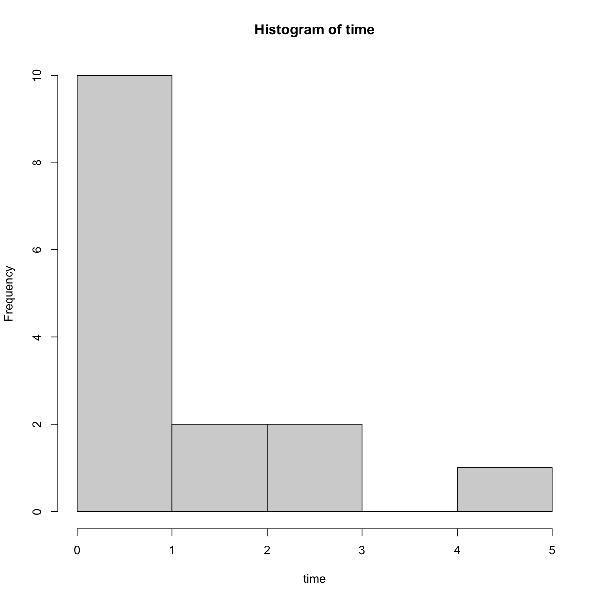

Note of course, in reality, the bins are not the same size so we can manually change the break-points to more accurately represent the data:

~~~
hist(time,breaks=c(0.0,0.5,1,2,4,5))
~~~
{: .language-r}

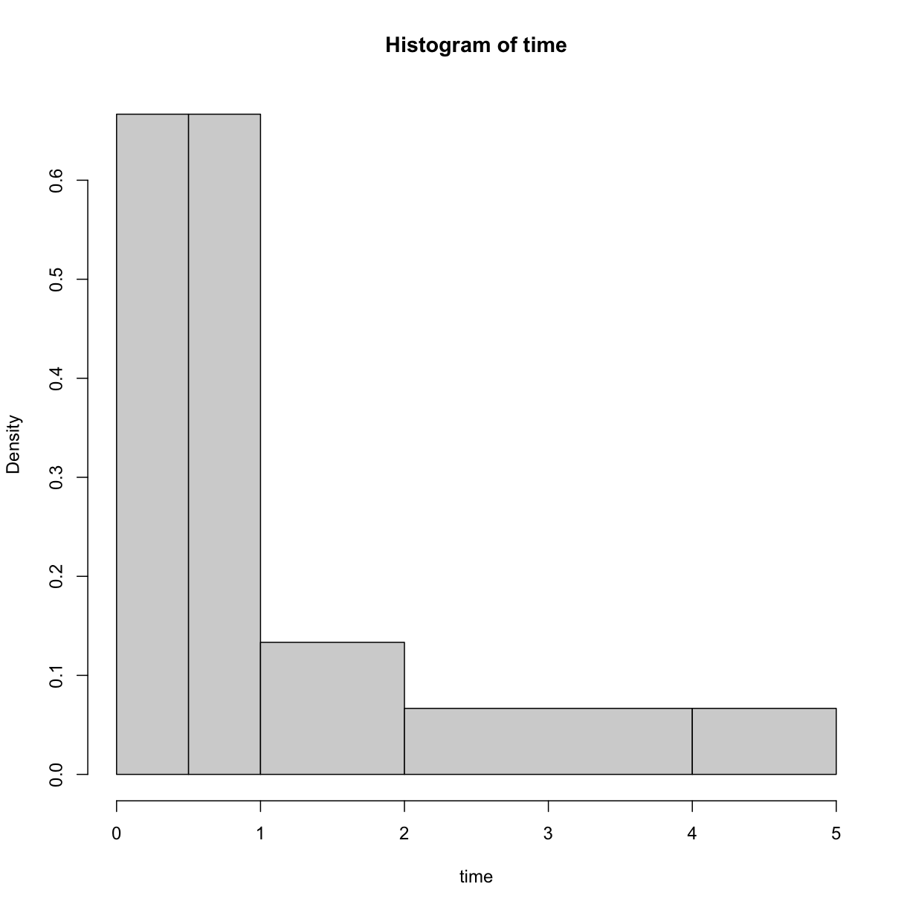

Hmmm, but that looks like density, not counts, how do we get counts?
~~~
help(hist)
~~~
{: .language-r}
> 
> <table width="100%" summary="page for hist {graphics}"><tr><td>hist {graphics}</td><td style="text-align: right;">R Documentation</td></tr></table>
> 
> <h2>Histograms</h2>
> 
> <h3>Description</h3>
> 
> 
The generic function <code>hist</code> computes a histogram of the given
> data values.  If <code>plot = TRUE</code>, the resulting object of
> <a href="../../base/html/class.html">class</a> <code>"histogram"</code> is plotted by
> <code><a href="plothistogram.html">plot.histogram</a></code>, before it is returned.
> 

> 
> 
> <h3>Usage</h3>
> 
> <pre>
> hist(x, ...)
> 
> ## Default S3 method:
> hist(x, breaks = "Sturges",
>      freq = NULL, probability = !freq,
>      include.lowest = TRUE, right = TRUE,
>      density = NULL, angle = 45, col = "lightgray", border = NULL,
>      main = paste("Histogram of" , xname),
>      xlim = range(breaks), ylim = NULL,
>      xlab = xname, ylab,
>      axes = TRUE, plot = TRUE, labels = FALSE,
>      nclass = NULL, warn.unused = TRUE, ...)
> </pre>
> 
> 
> <h3>Arguments</h3>
> 
> <table summary="R argblock">
> <tr valign="top"><td><code>x</code></td>
> <td>
> 
a vector of values for which the histogram is desired.

> </td></tr>
> <tr valign="top"><td><code>breaks</code></td>
> <td>
> 
one of:
> 

> 
> <ul>
> <li>
 a vector giving the breakpoints between histogram cells,
> 

> </li>
> <li>
 a function to compute the vector of breakpoints,
> 

> </li>
> <li>
 a single number giving the number of cells for the histogram,
> 

> </li>
> <li>
 a character string naming an algorithm to compute the
> number of cells (see &lsquo;Details&rsquo;),
> 

> </li>
> <li>
 a function to compute the number of cells.
> 

> </li></ul>
> 
> 
In the last three cases the number is a suggestion only; as the
> breakpoints will be set to <code><a href="../../base/html/pretty.html">pretty</a></code> values, the number
> is limited to <code>1e6</code> (with a warning if it was larger).  If
> <code>breaks</code> is a function, the <code>x</code> vector is supplied to it
> as the only argument (and the number of breaks is only limited by
> the amount of available memory).
> 

> </td></tr>
> <tr valign="top"><td><code>freq</code></td>
> <td>
> 
logical; if <code>TRUE</code>, the histogram graphic is a
> representation of frequencies, the <code>counts</code> component of
> the result; if <code>FALSE</code>, probability densities, component
> <code>density</code>, are plotted (so that the histogram has a total area
> of one).  Defaults to <code>TRUE</code> <em>if and only if</em> <code>breaks</code> are
> equidistant (and <code>probability</code> is not specified).

> </td></tr>
> <tr valign="top"><td><code>probability</code></td>
> <td>
> 
an <em>alias</em> for <code>!freq</code>, for S compatibility.

> </td></tr>
> <tr valign="top"><td><code>include.lowest</code></td>
> <td>
> 
logical; if <code>TRUE</code>, an <code>x[i]</code> equal to
> the <code>breaks</code> value will be included in the first (or last, for
> <code>right = FALSE</code>) bar.  This will be ignored (with a warning)
> unless <code>breaks</code> is a vector.

> </td></tr>
> <tr valign="top"><td><code>right</code></td>
> <td>
> 
logical; if <code>TRUE</code>, the histogram cells are
> right-closed (left open) intervals.

> </td></tr>
> <tr valign="top"><td><code>density</code></td>
> <td>
> 
the density of shading lines, in lines per inch.
> The default value of <code>NULL</code> means that no shading lines
> are drawn. Non-positive values of <code>density</code> also inhibit the
> drawing of shading lines.

> </td></tr>
> <tr valign="top"><td><code>angle</code></td>
> <td>
> 
the slope of shading lines, given as an angle in
> degrees (counter-clockwise).

> </td></tr>
> <tr valign="top"><td><code>col</code></td>
> <td>
> 
a colour to be used to fill the bars.
> The default of <code>NULL</code> yields unfilled bars.

> </td></tr>
> <tr valign="top"><td><code>border</code></td>
> <td>
> 
the color of the border around the bars.  The default
> is to use the standard foreground color.

> </td></tr>
> <tr valign="top"><td><code>main, xlab, ylab</code></td>
> <td>
> 
main title and axis labels: these arguments to
> <code><a href="title.html">title</a>()</code> get &ldquo;smart&rdquo; defaults here, e.g., the default
> <code>ylab</code> is <code>"Frequency"</code> iff <code>freq</code> is true.

> </td></tr>
> <tr valign="top"><td><code>xlim, ylim</code></td>
> <td>
> 
the range of x and y values with sensible defaults.
> Note that <code>xlim</code> is <em>not</em> used to define the histogram (breaks),
> but only for plotting (when <code>plot = TRUE</code>).

> </td></tr>
> <tr valign="top"><td><code>axes</code></td>
> <td>
> 
logical.  If <code>TRUE</code> (default), axes are draw if the
> plot is drawn.

> </td></tr>
> <tr valign="top"><td><code>plot</code></td>
> <td>
> 
logical.  If <code>TRUE</code> (default), a histogram is
> plotted, otherwise a list of breaks and counts is returned.  In the
> latter case, a warning is used if (typically graphical) arguments
> are specified that only apply to the <code>plot = TRUE</code> case.

> </td></tr>
> <tr valign="top"><td><code>labels</code></td>
> <td>
> 
logical or character string.  Additionally draw labels on top
> of bars, if not <code>FALSE</code>; see <code><a href="plothistogram.html">plot.histogram</a></code>.

> </td></tr>
> <tr valign="top"><td><code>nclass</code></td>
> <td>
> 
numeric (integer).  For S(-PLUS) compatibility only,
> <code>nclass</code> is equivalent to <code>breaks</code> for a scalar or
> character argument.

> </td></tr>
> <tr valign="top"><td><code>warn.unused</code></td>
> <td>
> 
logical.  If <code>plot = FALSE</code> and
> <code>warn.unused = TRUE</code>, a warning will be issued when graphical
> parameters are passed to <code>hist.default()</code>.

> </td></tr>
> <tr valign="top"><td><code>...</code></td>
> <td>
> 
further arguments and <a href="par.html">graphical parameters</a> passed to
> <code><a href="plothistogram.html">plot.histogram</a></code> and thence to <code><a href="title.html">title</a></code> and
> <code><a href="axis.html">axis</a></code> (if <code>plot = TRUE</code>).

> </td></tr>
> </table>
> 
> 
> <h3>Details</h3>
> 
> 
The definition of <em>histogram</em> differs by source (with
> country-specific biases).  <b>R</b>'s default with equi-spaced breaks (also
> the default) is to plot the counts in the cells defined by
> <code>breaks</code>.  Thus the height of a rectangle is proportional to
> the number of points falling into the cell, as is the area
> <em>provided</em> the breaks are equally-spaced.
> 

> 
The default with non-equi-spaced breaks is to give
> a plot of area one, in which the <em>area</em> of the rectangles is the
> fraction of the data points falling in the cells.
> 

> 
If <code>right = TRUE</code> (default), the histogram cells are intervals
> of the form <code>(a, b]</code>, i.e., they include their right-hand endpoint,
> but not their left one, with the exception of the first cell when
> <code>include.lowest</code> is <code>TRUE</code>.
> 

> 
For <code>right = FALSE</code>, the intervals are of the form <code>[a, b)</code>,
> and <code>include.lowest</code> means &lsquo;<em>include highest</em>&rsquo;.
> 

> 
A numerical tolerance of <i>1e-7</i> times the median bin size
> (for more than four bins, otherwise the median is substituted) is
> applied when counting entries on the edges of bins.  This is not
> included in the reported <code>breaks</code> nor in the calculation of
> <code>density</code>.
> 

> 
The default for <code>breaks</code> is <code>"Sturges"</code>: see
> <code><a href="../../grDevices/html/nclass.html">nclass.Sturges</a></code>.  Other names for which algorithms
> are supplied are <code>"Scott"</code> and <code>"FD"</code> /
> <code>"Freedman-Diaconis"</code> (with corresponding functions
> <code><a href="../../grDevices/html/nclass.html">nclass.scott</a></code> and <code><a href="../../grDevices/html/nclass.html">nclass.FD</a></code>).
> Case is ignored and partial matching is used.
> Alternatively, a function can be supplied which
> will compute the intended number of breaks or the actual breakpoints
> as a function of <code>x</code>.
> 

> 
> 
> <h3>Value</h3>
> 
> 
an object of class <code>"histogram"</code> which is a list with components:
> 

> <table summary="R valueblock">
> <tr valign="top"><td><code>breaks</code></td>
> <td>
> 
the <i>n+1</i> cell boundaries (= <code>breaks</code> if that
> was a vector). These are the nominal breaks, not with the boundary fuzz.

> </td></tr>
> <tr valign="top"><td><code>counts</code></td>
> <td>
> 
<i>n</i> integers; for each cell, the number of
> <code>x[]</code> inside.

> </td></tr>
> <tr valign="top"><td><code>density</code></td>
> <td>
> 
values <i>f^(x[i])</i>, as estimated
> density values. If <code>all(diff(breaks) == 1)</code>, they are the
> relative frequencies <code>counts/n</code> and in general satisfy
> <i>sum[i; f^(x[i])
>       (b[i+1]-b[i])] = 1</i>, where <i>b[i]</i> = <code>breaks[i]</code>.

> </td></tr>
> <tr valign="top"><td><code>mids</code></td>
> <td>
> 
the <i>n</i> cell midpoints.

> </td></tr>
> <tr valign="top"><td><code>xname</code></td>
> <td>
> 
a character string with the actual <code>x</code> argument name.

> </td></tr>
> <tr valign="top"><td><code>equidist</code></td>
> <td>
> 
logical, indicating if the distances between
> <code>breaks</code> are all the same.

> </td></tr>
> </table>
> 
> 
> <h3>References</h3>
> 
> 
Becker, R. A., Chambers, J. M. and Wilks, A. R. (1988)
> <em>The New S Language</em>.
> Wadsworth &amp; Brooks/Cole.
> 

> 
Venables, W. N. and Ripley. B. D. (2002)
> <em>Modern Applied Statistics with S</em>.  Springer.
> 

> 
> 
> <h3>See Also</h3>
> 
> 
<code><a href="../../grDevices/html/nclass.html">nclass.Sturges</a></code>, <code><a href="stem.html">stem</a></code>,
> <code><a href="../../stats/html/density.html">density</a></code>,  <code><a href="../../MASS/html/truehist.html">truehist</a></code> in package
> <a href="https://CRAN.R-project.org/package=MASS">MASS</a>.
> 

> 
Typical plots with vertical bars are <em>not</em> histograms.  Consider
> <code><a href="barplot.html">barplot</a></code> or <code><a href="plot.default.html">plot</a>(*, type = "h")</code>
> for such bar plots.
> 

> 
> 
> <h3>Examples</h3>
> 
> <pre>
> op &lt;- par(mfrow = c(2, 2))
> hist(islands)
> utils::str(hist(islands, col = "gray", labels = TRUE))
> 
> hist(sqrt(islands), breaks = 12, col = "lightblue", border = "pink")
> ##-- For non-equidistant breaks, counts should NOT be graphed unscaled:
> r &lt;- hist(sqrt(islands), breaks = c(4*0:5, 10*3:5, 70, 100, 140),
>           col = "blue1")
> text(r$mids, r$density, r$counts, adj = c(.5, -.5), col = "blue3")
> sapply(r[2:3], sum)
> sum(r$density * diff(r$breaks)) # == 1
> lines(r, lty = 3, border = "purple") # -&gt; lines.histogram(*)
> par(op)
> 
> require(utils) # for str
> str(hist(islands, breaks = 12, plot =  FALSE)) #-&gt; 10 (~= 12) breaks
> str(hist(islands, breaks = c(12,20,36,80,200,1000,17000), plot = FALSE))
> 
> hist(islands, breaks = c(12,20,36,80,200,1000,17000), freq = TRUE,
>      main = "WRONG histogram") # and warning
> 
> ## Extreme outliers; the "FD" rule would take very large number of 'breaks':
> XXL &lt;- c(1:9, c(-1,1)*1e300)
> hh &lt;- hist(XXL, "FD") # did not work in R &lt;= 3.4.1; now gives warning
> ## pretty() determines how many counts are used (platform dependently!):
> length(hh$breaks) ## typically 1 million -- though 1e6 was "a suggestion only"
> 
> require(stats)
> set.seed(14)
> x &lt;- rchisq(100, df = 4)
> 
> ## Comparing data with a model distribution should be done with qqplot()!
> qqplot(x, qchisq(ppoints(x), df = 4)); abline(0, 1, col = 2, lty = 2)
> 
> ## if you really insist on using hist() ... :
> hist(x, freq = FALSE, ylim = c(0, 0.2))
> curve(dchisq(x, df = 4), col = 2, lty = 2, lwd = 2, add = TRUE)
> 
> </pre>
> 
> 

[Package <em>graphics</em> version 4.0.3 <a href="00Index.html">Index</a>]

See there is a "freq" variable, set to `TRUE` to get counts:

~~~
hist(time,breaks=c(0.0,0.5,1,2,4,5),freq=TRUE)
~~~
{: .language-r}

~~~
Warning in plot.histogram(r, freq = freq1, col = col, border = border, angle =
angle, : the AREAS in the plot are wrong -- rather use 'freq = FALSE'
~~~
{: .warning}

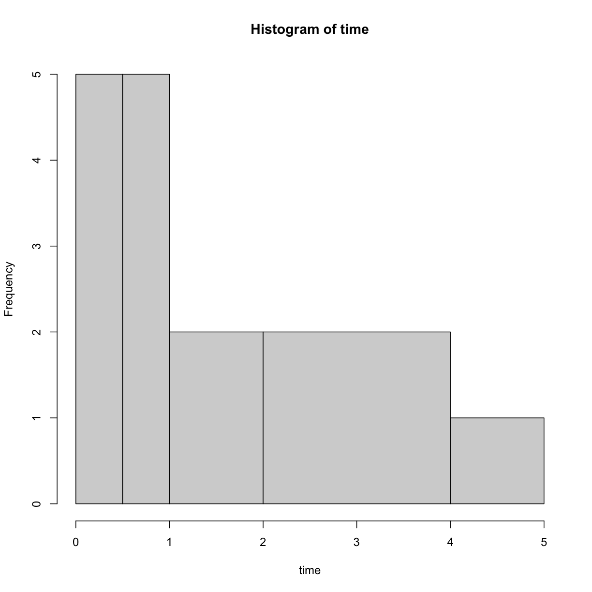

We get an error telling us that the areas are wrong, but we have to think about what that means for us $$\rightarrow$$ do we actually care?  Density is telling us the frequency over the unit time, but thats not what we really want $$\rightarrow$$ we want counts with bars representing actual times.

Picking which one depends on your data & how you want to present it and you have to make sure to think about it.

## Summary statistics for class data

Let's look at some summary stats for our data for how long folks have been programming:

~~~
summary(time)
~~~
{: .language-r}

~~~
   Min. 1st Qu.  Median    Mean 3rd Qu.    Max. 
  0.250   0.250   0.750   1.233   1.500   4.500 
~~~
{: .output}

Let's over plot where these are on our histograms using another plotting function called `abline` that overplots lines on our plots:

~~~
hist(time,breaks=c(0.0,0.5,1,2,4,5),freq=TRUE)

abline(v = mean(time), col = "blue", lwd = 2)
abline(v = median(time), col = "red", lwd = 2)
~~~
{: .language-r}

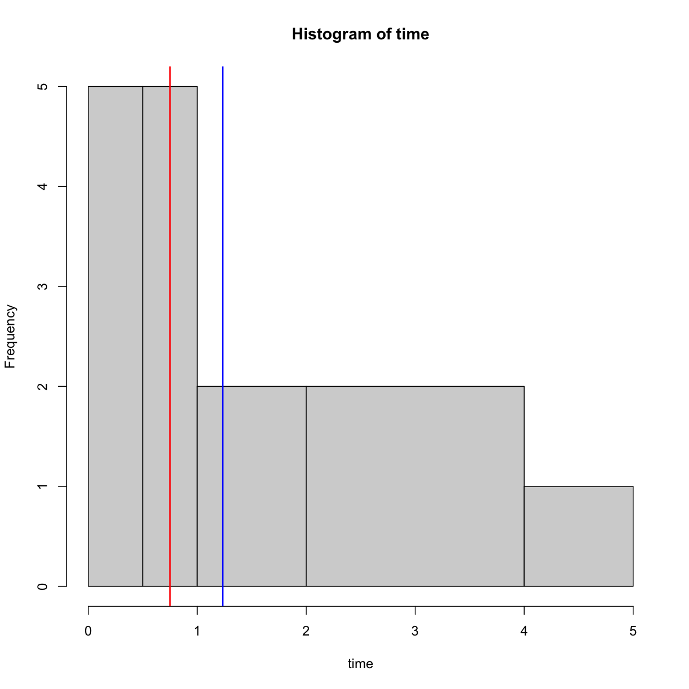

Let's also add a legend:

~~~
hist(time,breaks=c(0.0,0.5,1,2,4,5),freq=TRUE)

abline(v = mean(time), col = "blue", lwd = 2)
abline(v = median(time), col = "red", lwd = 2)

legend("topright",c("Mean","Median"),col=c("blue","red"),lwd=2)
~~~
{: .language-r}

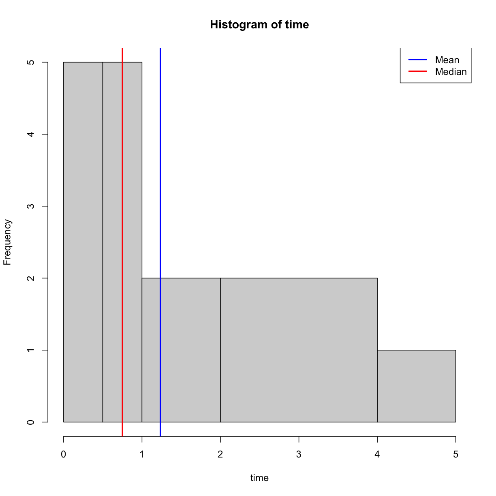

Something to think about - does the mean or median describe the distribution better here?  What do they mean if the box sizes are different?  Keep this thoughts with you over the next few classes.

Now let's say we add the data of an old person in like myself that has been programming for a bit:

~~~
new_time = c(time,18.0)
~~~
{: .language-r}

Let's overplot the mean and median of our new time on our old histogram:

~~~
# old plot
hist(time,breaks=c(0.0,0.5,1,2,4,5),freq=TRUE)
abline(v = mean(time), col = "blue", lwd = 2)
abline(v = median(time), col = "red", lwd = 2)
legend("topright",c("Mean","Median"),col=c("blue","red"),lwd=2)

# new additions
abline(v=mean(new_time),col="blue",lwd=4,lty=2)
abline(v=median(new_time),col="red",lwd=4,lty=2)
~~~
{: .language-r}

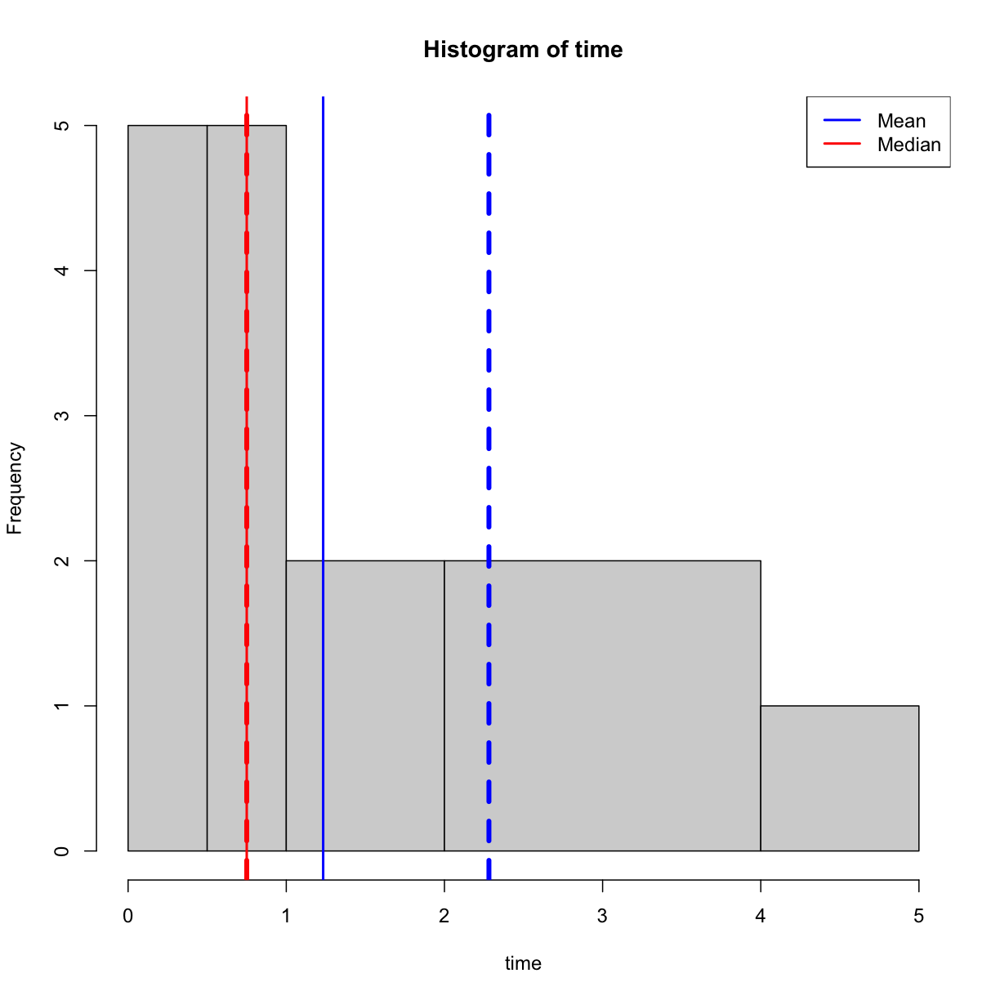

We see that the mean changes a lot, BUT the median does not $\rightarrow$ this is very interesting to think about when we want to characterize our data.

Let's try the same exercise with the standdard deviation and the interquartile range (IQR).  This time we'll try making some lines on our plot using the `lines` function instead of `abline` for some variety, first with our original dataset:

~~~
hist(time,breaks=c(0.0,0.5,1,2,4,5),freq=TRUE)

#  Usually (and later on in class) we'll talk about full STDDEV's around the mean, 
#    but 1/2 STDDEV is a little easier to see here
lines(c(mean(time)-0.5*sd(time),mean(time)+0.5*sd(time)),c(2,2), col="blue",lwd=2)
# lets add the 25th & 75th quantiles
lines(c(median(time)-0.5*IQR(time),median(time)+0.5*IQR(time)), c(1.5,1.5), col="red",lwd=2)

# again, lets add a little legend
legend("topright",c("STDDEV","Quartiles"),col=c("blue","red"),lwd=2)
~~~
{: .language-r}

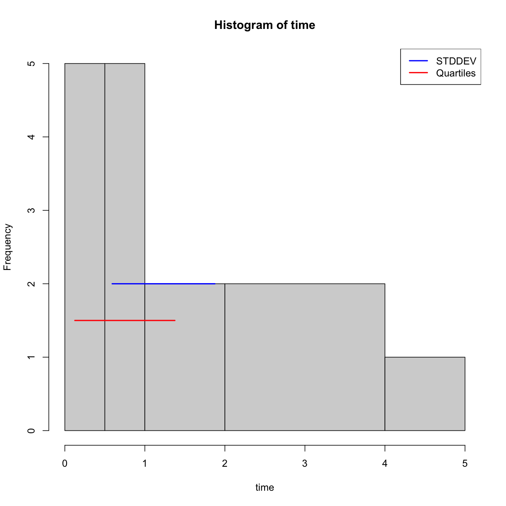

And let's see how both of these change with adding my data point:

~~~
# Old plot
hist(time,breaks=c(0.0,0.5,1,2,4,5),freq=TRUE)
lines(c(mean(time)-0.5*sd(time),mean(time)+0.5*sd(time)),c(2,2), col="blue",lwd=2)
lines(c(median(time)-0.5*IQR(time),median(time)+0.5*IQR(time)), c(1.5,1.5), col="red",lwd=2)
legend("topright",c("STDDEV","Quartiles"),col=c("blue","red"),lwd=2)

# new points
lines(c(mean(new_time)-0.5*sd(new_time),mean(new_time)+0.5*sd(new_time)),
      c(2,2), col="blue",lwd=4, lty=2)
lines(c(median(new_time)-0.5*IQR(new_time),median(new_time)+0.5*IQR(new_time)), 
      c(1.5,1.5), col="red",lwd=2,lty=2)
~~~
{: .language-r}

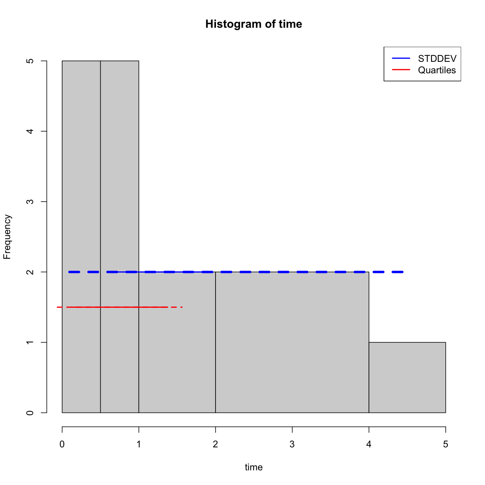

So, we also see that while the standdard deviation changes a lot with new and very different data, the quantiles do not (as much) -- also something interesting to consider in characterizing data!

## A few more things we can do with data

In RStudio, there a few helpful things you can try, like:

~~~
View(classData)
~~~
{: .language-r}

Or double clicking on "classData" in the "Global Environment" panel.

We can make a dotchart of the programming time range:

~~~
dotchart(time,xlab="Programming Age")
~~~
{: .language-r}

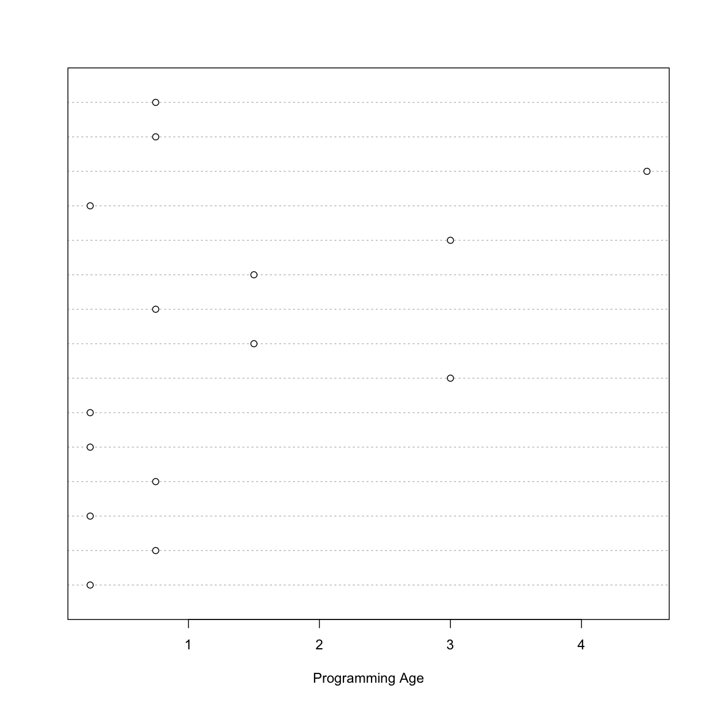
We can sort of see that there are a lot of dots $\lesssim$ 1 year, and a few at 3 years.

Note here: y-axis means nothing for dotcharts.

Can also see that in a boxplot:

~~~
boxplot(time)
~~~
{: .language-r}

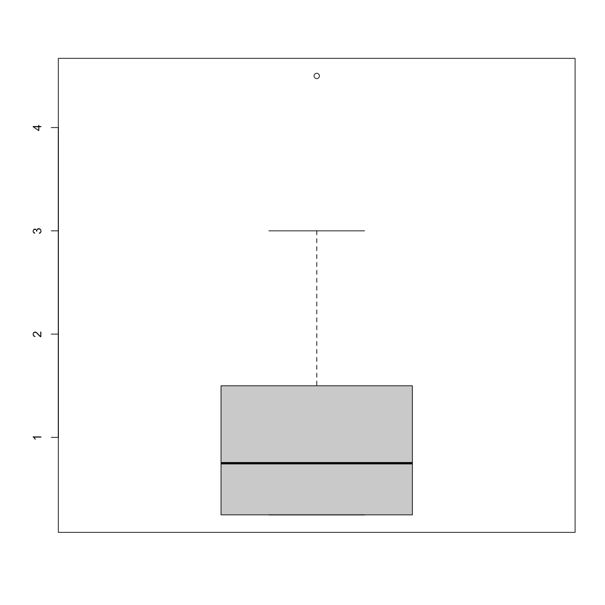

Note: we would usually have whiskers at the tops *and* bottoms but this can be different for different distributions.

Maybe lets remind ourselves of what we are plotting:

~~~
boxplot(time,ylab="Programming Age")
~~~
{: .language-r}

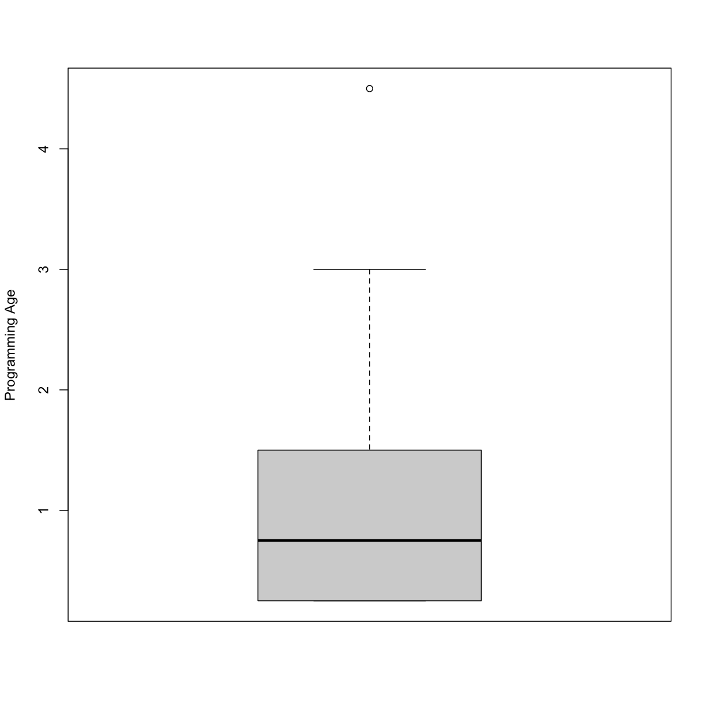

For this last one, lets also overlay the boxplot for newtime too:

~~~
boxplot(time,new_time, col=c("green","purple"))
~~~
{: .language-r}

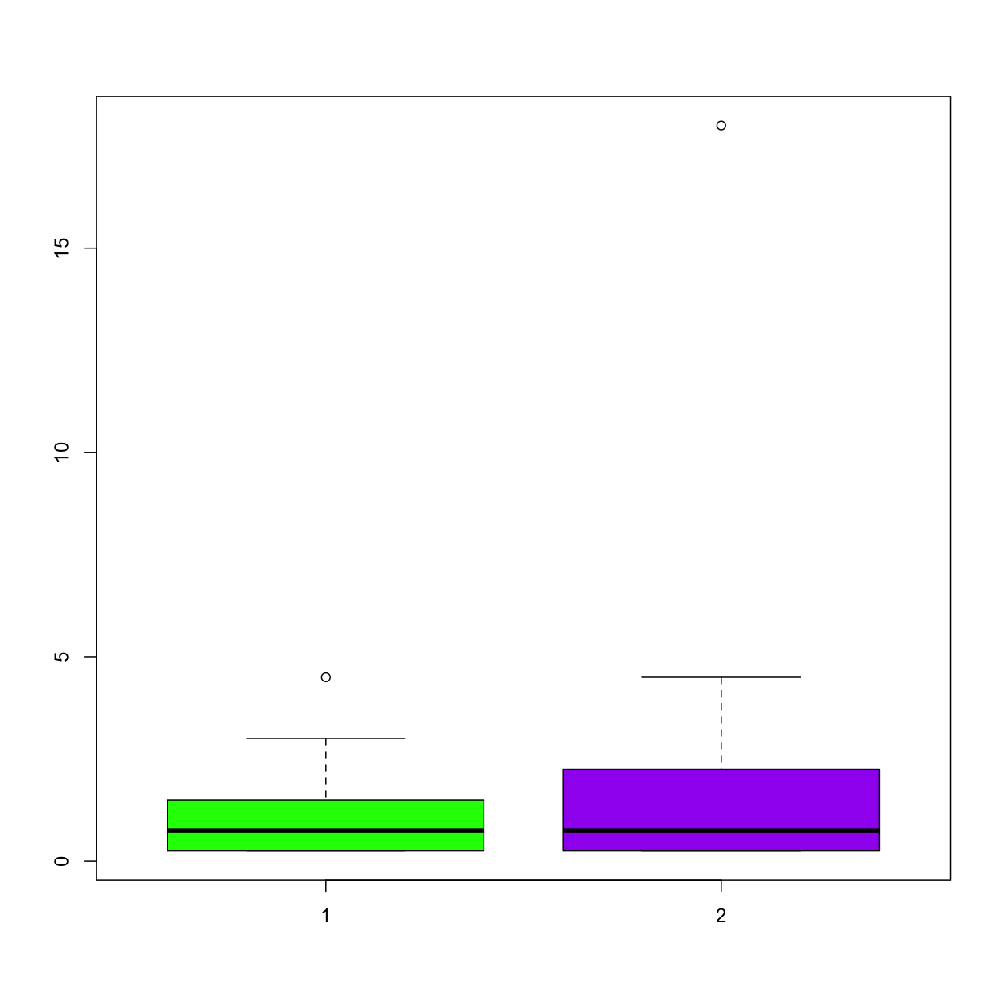
... and lets add a little legend too:

~~~
boxplot(time,new_time, col=c("green","purple"))
legend("topleft",c("Programming Age","New Programming Age"),fill=c("green","purple"))
~~~
{: .language-r}

Now we can see that again - the boxplots don't change a huge amount, only the new age one now includes an outlier point for my old-person programming age.

There are also a bunch of parameters you can change with boxplots we aren't going to get into here.
